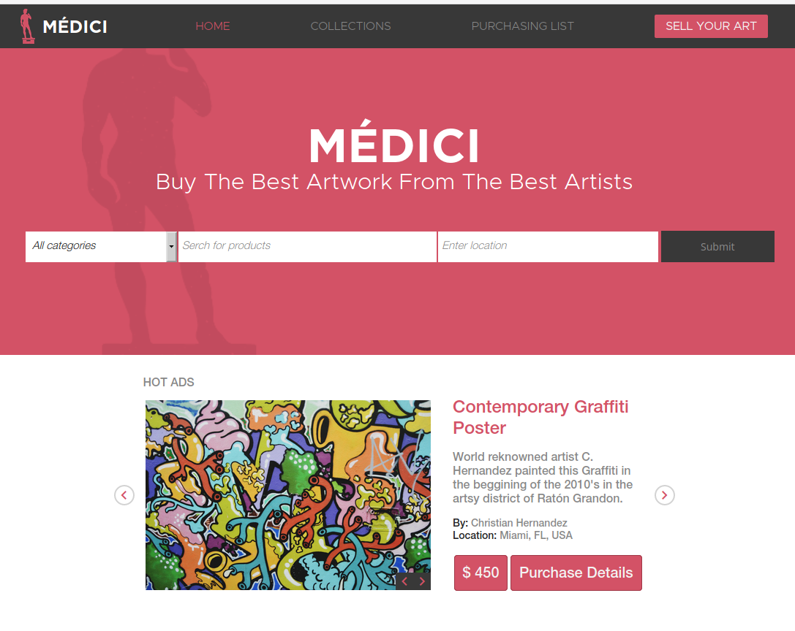
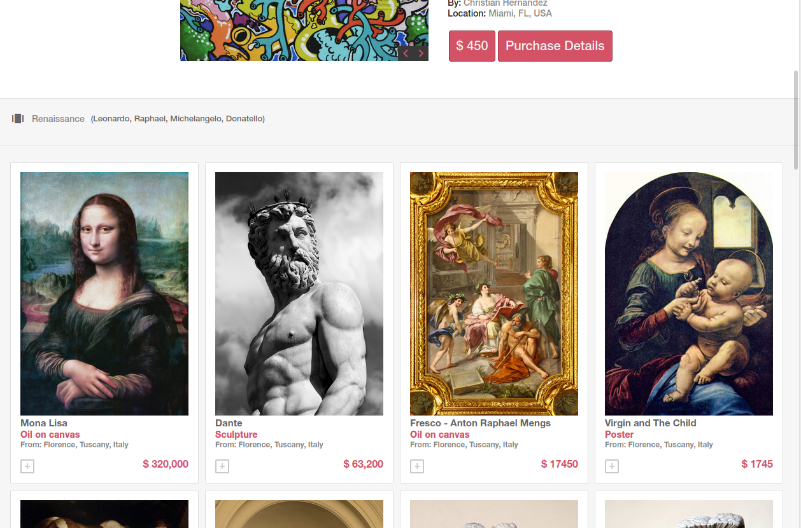
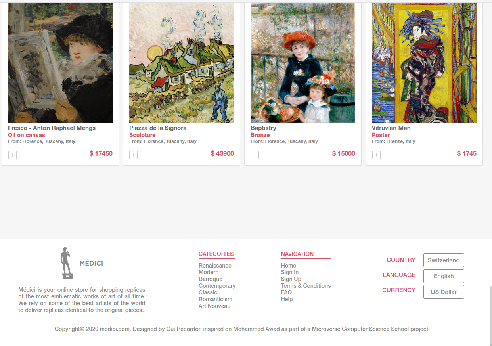
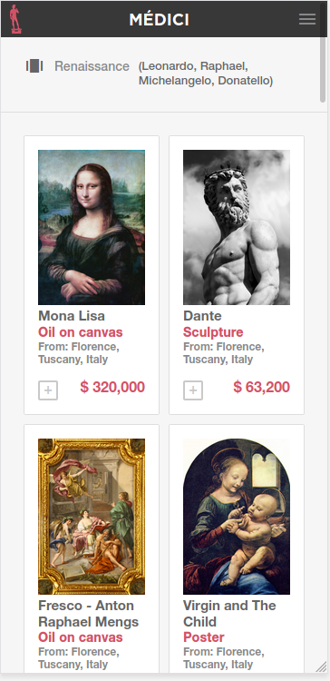
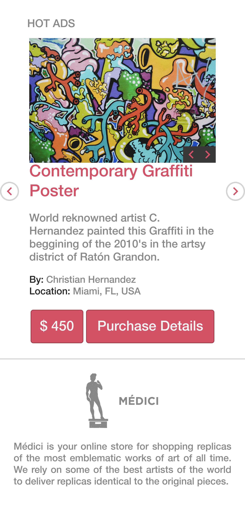
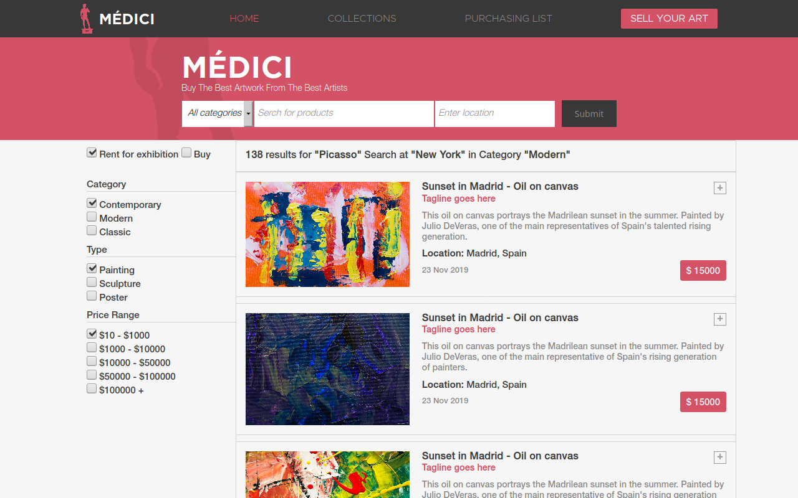
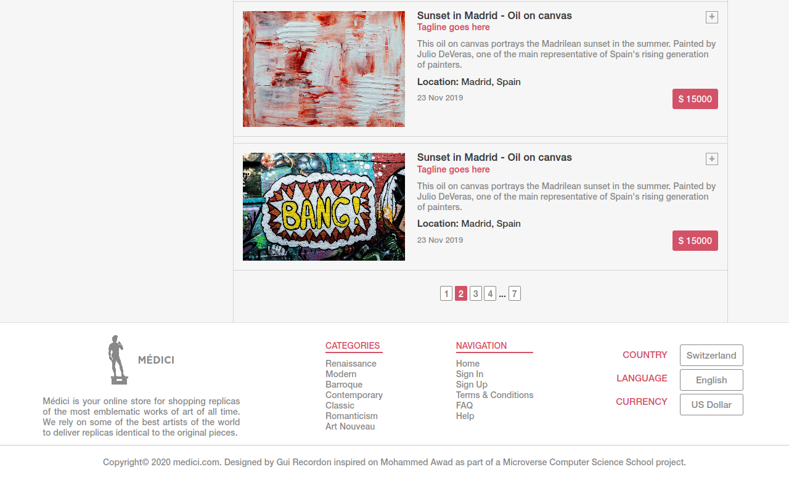
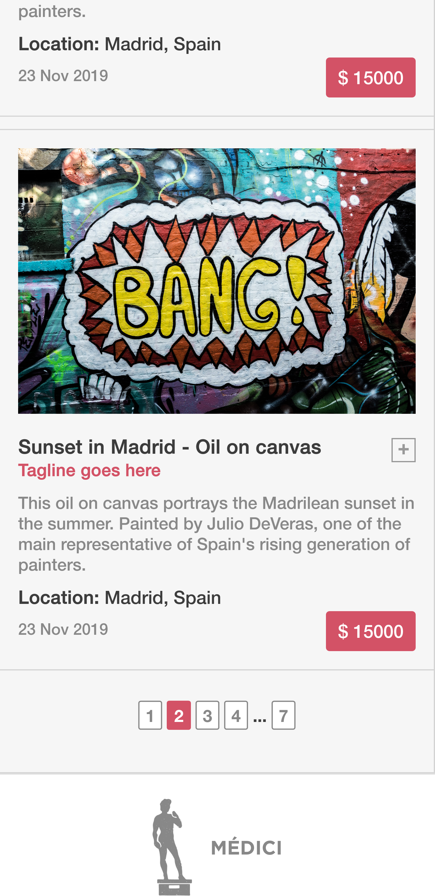

# Online Shop - HTML & CSS Microverse Capstone Project

>Capstone projects are solo projects at the end of each of the Microverse Main Technical Curriculum sections. They're also timed and the final work expected to be submitted in 72 hours. This one consists of building an online store having certain design constraints. I'm expected to draw inspiration from the following: 

Design Idea by [Mohammed Awad on Behance](https://www.behance.net/M_Awad)

Here's a link to the material that inspired this project: https://www.behance.net/gallery/24796463/ZATTIX

I chose to create an art gallery store from which one could buy replicas of the original art work displayed. The single coolest thing I walked away with from this project was the ability to manipulate images in a truly responsive way. I did it using this trick/method sometimes referred to as the Netflix trick. I even wrote an article about it explaining the details of its application. You can read it on [Hackernoon](https://hackernoon.com/how-to-create-truly-responsive-images-with-flexbox-2z4f3yjj)

Keep scrolling for screenshots of the page and a live demo.

## Built With

- CSS Flex and Grid,
- HMTL.

## Live Demo

[Live Demo Link - Main page](https://raw.githack.com/guirecordon/onlineshop/master/main.html)

[Live Demo Link - Search results page](https://raw.githack.com/guirecordon/onlineshop/master/search-results.html)

## Author

👤 **Guilherme Recordon**

- Github: [@guirecordon](https://github.com/guirecordon)
- Twitter: [@RecordonG](https://twitter.com/RecordonG)
- Linkedin: [Guilherme Recordon](https://linkedin.com/gui-recordon-marketingmba/)
- Email: guilherme.recordon@gmail.com

## 🤝 Contributing

Contributions, issues and feature requests are welcome!

Feel free to check the [issues page](https://github.com/guirecordon/bootstrap-newsweek-mockup/issues).

## Show your support

Give a ⭐️ if you like this project!

## Acknowledgments

Design Idea by 

Here's a link to the material that inspired this project: https://www.behance.net/gallery/24796463/ZATTIX
