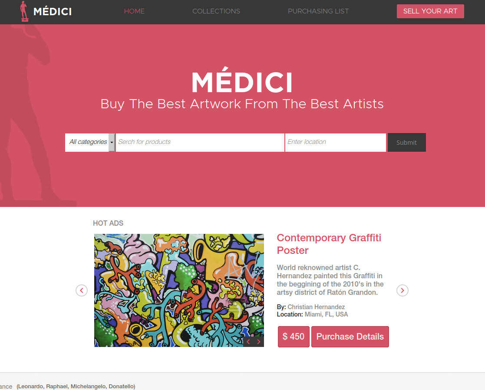
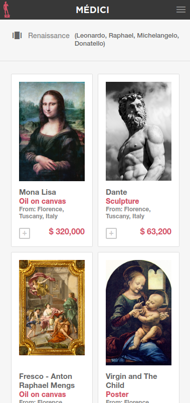
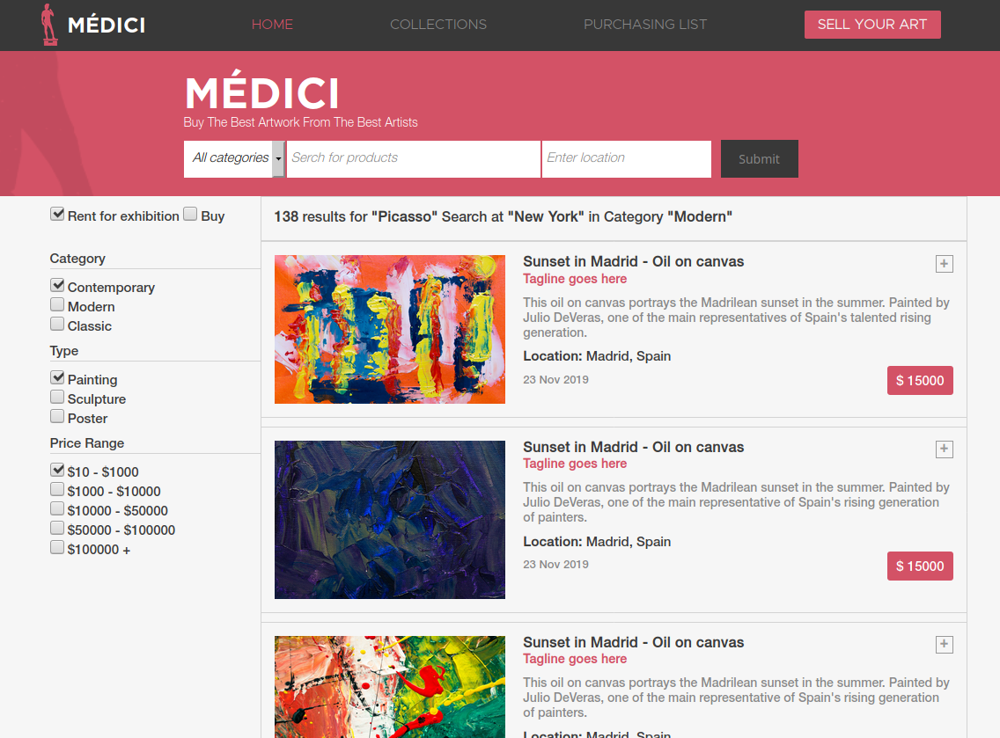
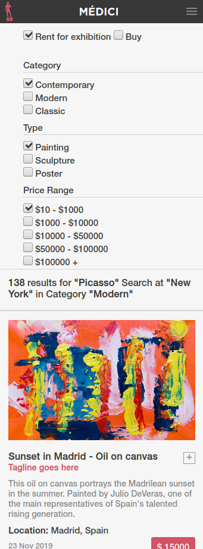

# Online Shop - HTML & CSS Microverse Capstone Project

>Capstone projects are solo projects at the end of the each of the Microverse Main Technical Curriculum sections. This one consists of building an online store having certain design constraints. I'm also expected to draw inspiration from the following: 

Design Idea by 

Here's a link to the material that inspired this project: https://www.behance.net/gallery/24796463/ZATTIX

## Built With

- CSS Flex and Grid,
- HMTL.

## Live Demo

[Live Demo Link - Main page](https://raw.githack.com/guirecordon/onlineshop/feature/main.html)

[Live Demo Link - Search results page](https://raw.githack.com/guirecordon/onlineshop/feature/search-results.html)

## Author

👤 **Guilherme Recordon**

- Github: [@guirecordon](https://github.com/guirecordon)
- Twitter: [@RecordonG](https://twitter.com/RecordonG)
- Linkedin: [Guilherme Recordon](https://linkedin.com/gui-recordon-marketingmba/)

## 🤝 Contributing

Contributions, issues and feature requests are welcome!

Feel free to check the [issues page](https://github.com/guirecordon/bootstrap-newsweek-mockup/issues).

## Show your support

Give a ⭐️ if you like this project!

## Acknowledgments

Design Idea by 

Here's a link to the material that inspired this project: https://www.behance.net/gallery/24796463/ZATTIX
